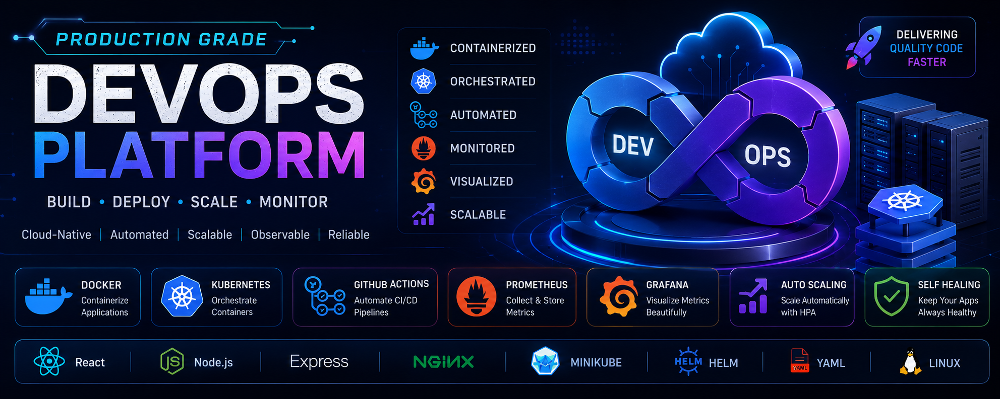
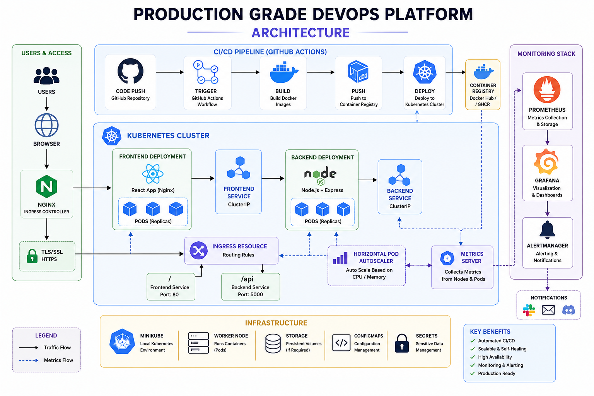

# 🚀 Production Grade DevOps Platform

<p align="center">
  <strong>A cloud-native DevOps platform demonstrating enterprise-grade CI/CD, container orchestration, monitoring, and Kubernetes deployment strategies.</strong>
</p>

<p align="center">


</p>

---

<p align="center">

</p>

---

# 📌 Overview

This repository demonstrates the complete lifecycle of deploying and managing a cloud-native application using modern DevOps practices.

The project focuses on containerization, Kubernetes orchestration, automated deployments, observability, and scalability while following production-oriented engineering principles.

---

# ✨ Key Features

## 📦 Containerization

- Docker
- Docker Compose
- Multi-container application

## ☸ Kubernetes

- Deployments
- ReplicaSets
- Services
- Ingress
- Namespaces

## 🚀 Deployment Strategies

- Rolling Updates
- Self-Healing
- Horizontal Pod Autoscaler (HPA)

## ⚙ Continuous Integration

- GitHub Actions
- Self-hosted Runner
- Automated Build Pipeline

## 📈 Monitoring

- Prometheus
- Grafana Dashboards
- Metrics Server

---

# 🏗 System Architecture

<p align="center">

</p>

---

# 🔄 CI/CD Workflow

```text
Developer
     │
     ▼
GitHub Repository
     │
     ▼
GitHub Actions
     │
     ▼
Docker Build
     │
     ▼
Kubernetes Deployment
     │
     ▼
Rolling Update
     │
     ▼
Running Pods
```

---

# 🛠 Technology Stack

| Category | Technologies |
|-----------|--------------|
| Frontend | React, Nginx |
| Backend | Node.js, Express.js |
| Containers | Docker, Docker Compose |
| Orchestration | Kubernetes, Minikube |
| CI/CD | GitHub Actions |
| Monitoring | Prometheus, Grafana |
| Scaling | HPA, Metrics Server |
| Version Control | Git, GitHub |

---

# 📊 Project Highlights

- Production-oriented project structure
- Containerized frontend and backend
- Kubernetes-native deployments
- Automated CI/CD pipeline
- Rolling deployments
- Self-healing architecture
- Horizontal auto scaling
- Centralized monitoring dashboards

---

# 📂 Repository Structure

```text
production-grade-devops-platform
│
├── app/
│   ├── backend/
│   └── frontend/
│
├── kubernetes/
│
├── docs/
│
├── diagrams/
│
├── screenshots/
│
├── .github/
│
├── docker-compose.yml
│
└── README.md
```

---

# 📈 Monitoring Stack

The platform includes a complete observability stack.

- Prometheus for metrics collection
- Grafana dashboards
- Kubernetes Metrics Server
- Resource utilization monitoring
- Pod health monitoring

---

# 📸 Project Screenshots

## Frontend


---

## Backend API


---

## Kubernetes Pods


---

## Horizontal Pod Autoscaler


---

## Grafana Dashboard


---

## Prometheus


---

# 🚀 Getting Started

## Clone Repository

```bash
git clone https://github.com/shivaamjaiswal5/production-grade-devops-platform.git
```

## Start Minikube

```bash
minikube start
```

## Deploy

```bash
kubectl apply -f kubernetes/
```

---

# 🗺 Roadmap

## ✅ Completed

- Docker
- Docker Compose
- Kubernetes
- Deployments
- Services
- Ingress
- Rolling Updates
- Self-Healing
- Horizontal Pod Autoscaler
- GitHub Actions
- Prometheus
- Grafana

## 🚧 In Progress

- Canary Deployment
- Blue-Green Deployment

## 📌 Planned

- Helm Charts
- Terraform
- AWS EKS
- Argo CD
- Centralized Logging
- Trivy Security Scanning
- SonarQube Integration

---

# 💼 Skills Demonstrated

- Docker & Containerization
- Kubernetes Administration
- CI/CD Automation
- GitHub Actions
- Infrastructure Monitoring
- Kubernetes Scaling
- Deployment Strategies
- Production Troubleshooting
- Cloud-Native Development

---

# 📄 License

This project is licensed under the MIT License.
