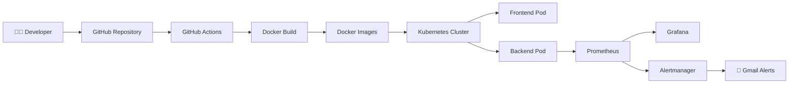
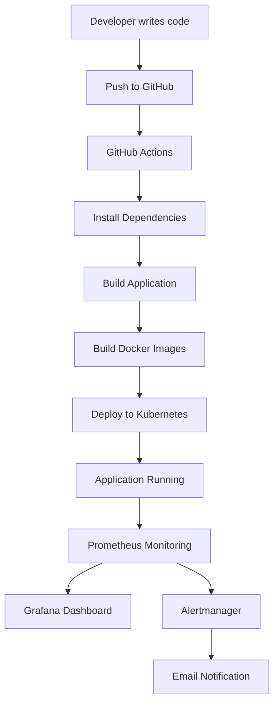
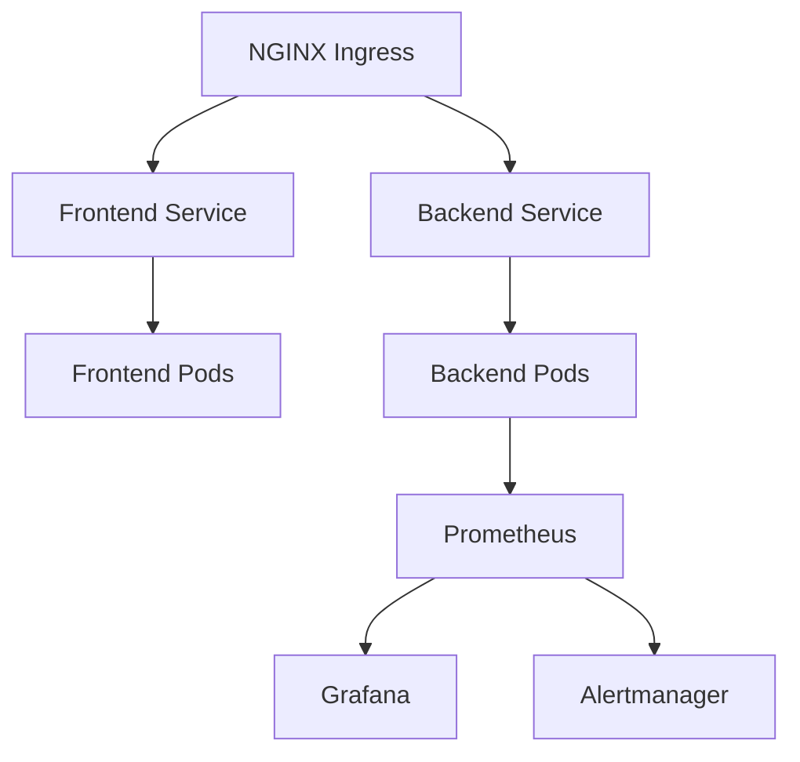
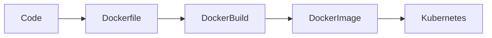
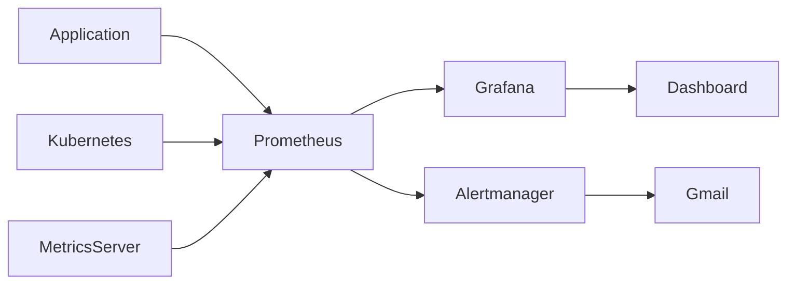

<div align="center">

# 🚀 Production-Grade DevOps Platform

### Enterprise-Grade Cloud Native Infrastructure using Docker • Kubernetes • Terraform • GitHub Actions • Prometheus • Grafana • Alertmanager

<p align="center">


</p>

<p align="center">


</p>

<p align="center">


</p>

---

### 💡 Build • Deploy • Scale • Monitor • Recover

*A hands-on DevOps project demonstrating a modern containerized application deployed on Kubernetes with CI/CD, Infrastructure as Code, observability, auto-scaling, and automated email alerting.*

</div>

---

# 📑 Table of Contents

- Project Overview
- Key Objectives
- Project Highlights
- Features
- Technology Stack
- Architecture
- CI/CD Pipeline
- Repository Structure
- Docker
- Kubernetes
- Terraform
- Monitoring
- Alerting
- Auto Scaling
- Self-Healing
- Load Testing
- Installation
- Usage
- Screenshots
- Roadmap
- Future Improvements
- Contributing
- License

---

# 📌 Project Overview

Modern software systems require much more than writing application code. They must be built, tested, deployed, monitored, scaled, and maintained reliably.

This repository demonstrates how multiple DevOps technologies can work together to automate the software delivery lifecycle and operate containerized applications in a Kubernetes environment.

The project combines containerization, continuous integration, Kubernetes orchestration, Infrastructure as Code, observability, and operational automation into a single repository.

Rather than focusing on a single tool, it shows how these technologies integrate to create a practical DevOps workflow.

---

# 🎯 Objectives

The primary goals of this project are to:

- Learn modern DevOps practices through implementation.
- Build an automated CI/CD workflow.
- Deploy applications using Kubernetes.
- Manage infrastructure using Terraform.
- Implement observability with Prometheus and Grafana.
- Configure automated email alerting using Alertmanager.
- Demonstrate horizontal auto-scaling.
- Explore Kubernetes self-healing capabilities.
- Perform load testing to observe system behavior.
- Organize everything into a maintainable repository.

---

# ⭐ Project Highlights

✅ Dockerized application

✅ Multi-container architecture

✅ GitHub Actions CI/CD

✅ Kubernetes Deployments

✅ Kubernetes Services

✅ NGINX Ingress

✅ Infrastructure as Code (Terraform)

✅ Prometheus Monitoring

✅ Grafana Dashboards

✅ Alertmanager Email Notifications

✅ Horizontal Pod Autoscaler (HPA)

✅ Kubernetes Self-Healing

✅ Rolling Updates

✅ Load Testing using k6

✅ Modular project structure

---

# 🚀 Why this Project?

This project was created to bring together several commonly used DevOps tools into a single workflow.

Instead of demonstrating individual technologies separately, it shows how they interact across the software delivery lifecycle—from source code to deployment, monitoring, and operational response.

It provides practical experience with:

- Containerization
- Orchestration
- Automation
- Infrastructure provisioning
- Monitoring
- Alerting
- Scaling
- Reliability

---

# ✨ Features

## 🐳 Containerization

- Dockerized frontend
- Dockerized backend
- Multi-stage builds (where applicable)
- Docker Compose support
- Environment-based configuration

---

## ☸ Kubernetes

- Deployments
- ReplicaSets
- Services
- Configurations
- Namespaces
- Rolling Updates
- Self-Healing
- Ingress
- Horizontal Pod Autoscaler

---

## 🔄 Continuous Integration

GitHub Actions automates the build process whenever changes are pushed to the repository.

Typical workflow includes:

- Checkout repository
- Install dependencies
- Build application
- Build Docker images
- Validate deployment manifests

---

## 📦 Infrastructure as Code

Infrastructure provisioning is managed using Terraform.

The project demonstrates how infrastructure can be defined declaratively and version-controlled alongside application code.

---

## 📈 Monitoring

Prometheus collects metrics from the Kubernetes environment.

Metrics are used to observe application health, cluster status, and infrastructure behavior.

---

## 📊 Visualization

Grafana provides dashboards for monitoring the application's operational metrics.

Dashboards make it easier to analyze resource usage, deployments, and system performance.

---

## 🚨 Alerting

Alertmanager is configured to send email notifications when predefined alert conditions are met.

Example:

- Backend unavailable
- Service down
- Infrastructure issues

---

## ⚖ Auto Scaling

Horizontal Pod Autoscaler automatically adjusts the number of application replicas based on resource utilization.

This helps applications adapt to varying workloads.

---

## ❤️ Self-Healing

Kubernetes automatically restores failed containers by restarting or recreating Pods according to the desired state defined in Deployments.

---

## 🧪 Load Testing

The repository includes load testing using k6 to evaluate application behavior under increased traffic and to observe scaling and monitoring in action.

---

# 🏆 Learning Outcomes

By completing this project, practical experience is gained in:

- Docker
- Kubernetes
- Terraform
- GitHub Actions
- Prometheus
- Grafana
- Alertmanager
- Infrastructure as Code
- CI/CD
- Monitoring
- Auto Scaling
- Operational troubleshooting

---

# 📖 What's Next?

The following sections cover the technical architecture, repository organization, deployment workflow, monitoring stack, and operational capabilities in more detail.

---

# 🏗️ System Architecture

The Production-Grade DevOps Platform follows a modern cloud-native architecture where every stage of the software delivery lifecycle is automated—from code commit to deployment, monitoring, and alerting.

The platform is designed around the following DevOps principles:

- Automation
- Infrastructure as Code
- Containerization
- Continuous Integration
- Kubernetes Orchestration
- Observability
- Scalability
- Reliability

---

## High-Level Architecture



---

# 🔄 End-to-End DevOps Workflow



---

# ⚙️ Technology Stack

## Programming

| Technology | Purpose |
|------------|----------|
| JavaScript | Application Development |
| Node.js | Backend Runtime |
| React | Frontend Application |
| HTML/CSS | User Interface |

---

## Containerization

| Tool | Purpose |
|------|----------|
| Docker | Containerization |
| Docker Compose | Local Multi-Container Development |

---

## Kubernetes

| Tool | Purpose |
|------|----------|
| Kubernetes | Container Orchestration |
| Minikube | Local Kubernetes Cluster |
| kubectl | Kubernetes CLI |
| Ingress NGINX | External Access |
| Metrics Server | Resource Metrics |
| HPA | Horizontal Scaling |

---

## CI/CD

| Tool | Purpose |
|------|----------|
| GitHub Actions | Continuous Integration |
| Git | Version Control |
| GitHub | Source Code Management |

---

## Infrastructure

| Tool | Purpose |
|------|----------|
| Terraform | Infrastructure as Code |

---

## Monitoring

| Tool | Purpose |
|------|----------|
| Prometheus | Metrics Collection |
| Grafana | Visualization |
| Alertmanager | Alert Routing |

---

## Testing

| Tool | Purpose |
|------|----------|
| k6 | Load Testing |

---

# 🏛️ Kubernetes Architecture



---

# 🔄 CI/CD Pipeline

The project uses GitHub Actions to automate the build workflow.

## Pipeline Overview

```text
Developer
      │
      ▼
Git Push
      │
      ▼
GitHub Repository
      │
      ▼
GitHub Actions
      │
      ▼
Install Dependencies
      │
      ▼
Build Project
      │
      ▼
Build Docker Images
      │
      ▼
Deploy to Kubernetes
      │
      ▼
Running Application
```

---

## Pipeline Stages

### Stage 1 — Source Control

Developers commit changes to the GitHub repository.

---

### Stage 2 — Continuous Integration

GitHub Actions automatically triggers on repository events.

Typical workflow includes:

- Checkout repository
- Install dependencies
- Build frontend
- Build backend
- Validate configuration

---

### Stage 3 — Docker

Docker images are built for each application component.

Benefits include:

- Environment consistency
- Reproducible builds
- Simplified deployments

---

### Stage 4 — Kubernetes Deployment

Deployment manifests define the desired state of the application.

Kubernetes schedules containers across cluster nodes and manages their lifecycle.

---

### Stage 5 — Monitoring

Prometheus continuously collects metrics from the cluster.

Metrics include:

- CPU utilization
- Memory usage
- Pod status
- Deployment health

---

### Stage 6 — Visualization

Grafana dashboards provide insights into cluster health and application performance.

---

### Stage 7 — Alerting

Alertmanager evaluates configured rules and sends email notifications for significant events.

Examples include:

- Deployment unavailable
- Application downtime
- Resource threshold exceeded

---

# 📂 Infrastructure Components

| Component | Description |
|------------|-------------|
| Frontend | React-based user interface |
| Backend | REST API service |
| Docker | Container runtime |
| Kubernetes | Orchestration platform |
| Ingress | External traffic routing |
| Terraform | Infrastructure provisioning |
| Prometheus | Metrics collection |
| Grafana | Metrics visualization |
| Alertmanager | Notification routing |
| GitHub Actions | CI automation |

---

# 🎯 Design Goals

The architecture emphasizes:

- Automation
- High availability
- Maintainability
- Scalability
- Observability
- Reliability
- Modular design
- Reproducible deployments

---

---

# 📂 Repository Structure

The project is organized into modular components, making it easier to maintain, extend, and deploy.

```text
production-grade-devops-platform/
│
├── .github/
│   └── workflows/
│       └── ci.yml
│
├── backend/
│   ├── src/
│   ├── package.json
│   ├── Dockerfile
│   └── ...
│
├── frontend/
│   ├── src/
│   ├── public/
│   ├── package.json
│   ├── Dockerfile
│   └── ...
│
├── terraform/
│   ├── provider.tf
│   ├── variables.tf
│   ├── outputs.tf
│   ├── vpc.tf
│   ├── eks.tf
│   └── ...
│
├── k8s/
│   ├── backend/
│   ├── frontend/
│   ├── ingress/
│   ├── monitoring/
│   ├── alertmanager/
│   ├── hpa/
│   └── namespace/
│
├── scripts/
│
├── docker-compose.yml
├── README.md
└── LICENSE
```

---

# 📁 Directory Overview

| Directory | Purpose |
|------------|----------|
| backend | Backend application source code |
| frontend | Frontend application |
| .github | GitHub Actions workflows |
| terraform | Infrastructure as Code |
| k8s | Kubernetes manifests |
| scripts | Utility and automation scripts |
| docs | Documentation and screenshots |

---

# 🐳 Docker Implementation

Containerization is the foundation of this platform.

Each application component is packaged into an independent Docker image.

This provides:

- Environment consistency
- Faster deployments
- Dependency isolation
- Portability
- Reproducible builds

---

## Docker Workflow



---

## Why Docker?

Traditional deployment problems include:

- Dependency conflicts
- Different environments
- Manual setup
- Version mismatches

Docker solves these by packaging everything required to run the application into a portable image.

---

## Docker Components

### Frontend Container

Responsibilities:

- Build React application
- Serve frontend
- Connect with backend

---

### Backend Container

Responsibilities:

- Expose REST APIs
- Process requests
- Handle business logic

---

### Docker Compose

Docker Compose enables running multiple containers locally using a single configuration.

Benefits include:

- Faster development
- Easy local testing
- Consistent developer environment

---

# ☸ Kubernetes Deployment

After building Docker images, the application is deployed into Kubernetes.

Kubernetes manages:

- Scheduling
- Scaling
- Recovery
- Networking
- Service Discovery

---

## Kubernetes Components

### Deployments

Deployments ensure the desired number of Pods are always available.

Responsibilities:

- Create Pods
- Update Pods
- Rollback
- Self-healing

---

### ReplicaSets

ReplicaSets maintain the required number of replicas.

If a Pod crashes, Kubernetes automatically creates another one.

---

### Pods

Pods are the smallest deployable unit inside Kubernetes.

Each Pod contains:

- Application container
- Network configuration
- Storage volumes (if required)

---

### Services

Services provide stable networking for Pods.

Without Services:

- Pod IPs constantly change.

With Services:

- Applications communicate using a fixed endpoint.

---

## Service Types

| Type | Purpose |
|--------|----------|
| ClusterIP | Internal communication |
| NodePort | External testing |
| LoadBalancer | Cloud deployments |
| Ingress | HTTP/HTTPS routing |

---

# 🌐 Ingress

Ingress provides a single entry point into the Kubernetes cluster.

Instead of exposing multiple services separately, Ingress routes requests based on rules.

Example:

```
/ → Frontend

/api → Backend
```

---

## Ingress Architecture

```mermaid
flowchart TD

Internet

↓

NGINX Ingress

↓

Frontend Service

↓

Frontend Pods

NGINX Ingress

↓

Backend Service

↓

Backend Pods
```

---

# 📦 Namespaces

Namespaces logically separate resources inside Kubernetes.

Benefits include:

- Better organization
- Environment isolation
- Resource management

Example namespaces:

```
production-devops

monitoring

default
```

---

# ⚙ ConfigMaps

ConfigMaps store non-sensitive configuration.

Examples:

- Environment variables
- URLs
- Feature flags
- Application settings

Advantages:

- No image rebuild required
- Centralized configuration
- Easier updates

---

# 🔐 Secrets

Sensitive information is stored using Kubernetes Secrets.

Examples:

- SMTP Password
- API Keys
- Access Tokens
- Database Credentials

Benefits:

- Keeps sensitive data separate from application code
- Better security practices
- Easier credential rotation

---

# 🚀 Deployment Strategy

The project uses Kubernetes Deployments to perform rolling updates.

Benefits:

- Zero or minimal downtime
- Controlled rollout
- Automatic rollback support (when configured)
- Gradual replacement of old Pods

---

## Rolling Update Process

```mermaid
flowchart LR

OldPods

↓

CreateNewPods

↓

HealthCheck

↓

RemoveOldPods

↓

DeploymentComplete
```

---

# 🔄 Kubernetes Resource Relationships

```mermaid
flowchart TD

Deployment

↓

ReplicaSet

↓

Pods

↓

Service

↓

Ingress

↓

Users
```

---

# 🎯 Kubernetes Advantages

This platform benefits from Kubernetes through:

- Container orchestration
- High availability
- Automated recovery
- Rolling deployments
- Service discovery
- Horizontal scaling
- Declarative configuration

---

# 💡 Design Decisions

Several architectural decisions were made while building this platform:

### Why Kubernetes?

- Declarative deployments
- Automatic recovery
- Industry adoption
- Scalability

---

### Why Docker?

- Lightweight containers
- Consistent runtime
- Easy deployment

---

### Why GitHub Actions?

- Native GitHub integration
- Automated workflows
- Version-controlled pipelines

---

### Why Terraform?

- Infrastructure as Code
- Repeatable provisioning
- Version control for infrastructure

---

# 📌 Summary

At this stage, the platform supports:

✅ Dockerized applications

✅ Kubernetes Deployments

✅ Services

✅ Ingress

✅ Rolling Updates

✅ Self-Healing

✅ ConfigMaps

✅ Secrets

✅ Infrastructure as Code

✅ CI/CD integration

---

---

# 📈 Observability & Monitoring

Modern cloud-native applications require continuous visibility into system health, resource utilization, and application performance.

This platform integrates Prometheus, Grafana, Alertmanager, and Kubernetes Metrics Server to provide end-to-end observability.

The monitoring stack enables:

- Real-time infrastructure monitoring
- Application health monitoring
- Resource utilization tracking
- Automated alerting
- Performance visualization
- Capacity planning
- Operational troubleshooting

---

# 🔍 Monitoring Architecture



---

# 📊 Monitoring Stack

| Component | Purpose |
|------------|----------|
| Prometheus | Metrics Collection |
| Grafana | Visualization |
| Alertmanager | Notification Routing |
| Metrics Server | CPU & Memory Metrics |
| Gmail SMTP | Email Notifications |

---

# 📈 Prometheus

Prometheus is responsible for collecting and storing time-series metrics from the Kubernetes cluster.

It continuously scrapes metrics from configured targets and stores them in its time-series database.

Collected metrics include:

- CPU Usage
- Memory Usage
- Pod Status
- Deployment Status
- Node Health
- Container Metrics
- Kubernetes Metrics

---

## Why Prometheus?

Prometheus provides:

- Time-series database
- Powerful PromQL queries
- Kubernetes integration
- Alerting support
- Efficient metric storage

---

## Prometheus Workflow

```mermaid
flowchart LR

Pods --> Prometheus

Nodes --> Prometheus

Metrics Server --> Prometheus

Prometheus --> TSDB

TSDB --> Grafana

TSDB --> Alertmanager
```

---

# 📊 Grafana

Grafana transforms raw Prometheus metrics into interactive dashboards.

Dashboards provide a visual representation of system behavior and performance trends.

Examples include:

- CPU Usage
- Memory Usage
- Pod Health
- Deployment Status
- Kubernetes Cluster Metrics
- Node Utilization

---

## Benefits of Grafana

- Real-time dashboards
- Interactive charts
- Historical trends
- Custom dashboards
- Prometheus integration

---

## Dashboard Examples

The project includes dashboards for:

- Kubernetes Cluster Overview
- Application Metrics
- CPU Utilization
- Memory Utilization
- Pod Status
- Deployment Health

---

# 🚨 Alertmanager

Monitoring is useful only when issues are detected and communicated effectively.

Alertmanager receives alerts from Prometheus and routes notifications to configured receivers.

This project uses Gmail SMTP to send email notifications.

---

## Alert Flow

```mermaid
flowchart LR

PrometheusRule

↓

Prometheus

↓

Alertmanager

↓

SMTP

↓

Gmail

↓

Developer
```

---

# Email Notifications

Configured notification scenarios include:

- Backend service unavailable
- Deployment failures
- Infrastructure issues

Example notification:

```
[FIRING] BackendDown

Namespace:
production-devops

Deployment:
backend-deployment

Status:
Unavailable
```

---

# Alert Lifecycle

```mermaid
flowchart LR

Metric

↓

Rule Evaluation

↓

Alert Pending

↓

Alert Firing

↓

Email Sent

↓

Issue Fixed

↓

Resolved Notification
```

---

# ⚙ Metrics Server

Metrics Server provides resource metrics required by Kubernetes.

It enables:

- CPU Metrics
- Memory Metrics
- HPA Decisions

Without Metrics Server:

Horizontal Pod Autoscaler cannot function.

---

# 📈 Horizontal Pod Autoscaler (HPA)

One of the most important Kubernetes features demonstrated in this project is automatic scaling.

The Horizontal Pod Autoscaler dynamically adjusts the number of running Pods according to resource utilization.

---

## Auto Scaling Workflow

```mermaid
flowchart TD

Traffic Increases

↓

CPU Usage Increases

↓

Metrics Server

↓

Horizontal Pod Autoscaler

↓

Increase Replicas

↓

Application Handles More Requests
```

---

## Scaling Benefits

- Improved availability
- Better performance
- Automatic response to workload changes
- Efficient resource utilization

---

## HPA Components

| Component | Responsibility |
|------------|---------------|
| Metrics Server | Collect Metrics |
| HPA | Evaluate Threshold |
| Deployment | Create Replicas |
| Pods | Handle Traffic |

---

# ❤️ Self-Healing

Self-healing is a fundamental Kubernetes capability.

If a Pod crashes or becomes unhealthy, Kubernetes automatically restores the desired state.

---

## Self-Healing Workflow

```mermaid
flowchart TD

Pod Running

↓

Pod Failure

↓

ReplicaSet Detects Failure

↓

New Pod Created

↓

Application Restored
```

---

## Demonstration

Example scenario:

1. Delete Backend Pod

```
kubectl delete pod backend-pod
```

Kubernetes automatically creates a replacement Pod without manual intervention.

---

# 🔄 Rolling Updates

Rolling Updates allow application versions to be updated gradually.

Benefits:

- Minimal downtime
- Controlled deployment
- Reduced deployment risk

---

## Rolling Update Process

```mermaid
flowchart LR

Version 1

↓

Create Version 2 Pod

↓

Health Check

↓

Remove Old Pod

↓

Repeat

↓

Deployment Complete
```

---

# 🧪 Load Testing

The project uses **k6** to simulate traffic and evaluate application behavior under load.

Load testing helps validate:

- Application stability
- Resource utilization
- Auto-scaling behavior
- Response times

---

## Load Testing Workflow

```mermaid
flowchart TD

k6

↓

HTTP Requests

↓

Frontend

↓

Backend

↓

Metrics

↓

Prometheus

↓

Grafana
```

---

# Performance Validation

During testing the platform can be observed for:

- CPU Usage
- Memory Usage
- Response Time
- Replica Count
- Alert Generation
- Cluster Stability

---

# 📌 Monitoring Features Summary

| Feature | Status |
|----------|--------|
| Prometheus Monitoring | ✅ |
| Grafana Dashboards | ✅ |
| Alertmanager | ✅ |
| Gmail Email Alerts | ✅ |
| Metrics Server | ✅ |
| Horizontal Pod Autoscaler | ✅ |
| Self-Healing | ✅ |
| Rolling Updates | ✅ |
| Load Testing | ✅ |

---

# 🎯 Key Takeaways

The monitoring stack provides:

- Complete visibility into application health
- Real-time infrastructure monitoring
- Automatic alert notifications
- Auto-scaling based on demand
- Reliable Kubernetes operations
- Improved troubleshooting capabilities

---

---

# 🚀 Getting Started

This section explains how to set up and run the project locally.

---

# 📋 Prerequisites

Ensure the following tools are installed before starting.

| Tool | Version |
|-------|----------|
| Git | Latest |
| Docker Desktop | Latest |
| Kubernetes | v1.30+ |
| Minikube | Latest |
| kubectl | Compatible with Kubernetes |
| Terraform | v1.5+ |
| Node.js | v18+ |
| npm | Latest |
| GitHub Account | Required |
| Gmail Account | For Alertmanager SMTP |

---

# ⚙ Installation

## Clone Repository

```bash
git clone https://github.com/shivaamjaiswal5/production-grade-devops-platform.git

cd production-grade-devops-platform
```

---

## Install Dependencies

### Backend

```bash
cd backend

npm install
```

---

### Frontend

```bash
cd frontend

npm install
```

---

# 🐳 Docker

Build Docker Images

```bash
docker build -t devops-backend .

docker build -t devops-frontend .
```

Run Containers

```bash
docker compose up --build
```

---

# ☸ Kubernetes Deployment

Start Minikube

```bash
minikube start
```

Deploy Application

```bash
kubectl apply -f k8s/
```

Verify Pods

```bash
kubectl get pods
```

Verify Services

```bash
kubectl get svc
```

Verify Deployments

```bash
kubectl get deployments
```

---

# 🌐 Access Application

```bash
minikube service frontend-service
```

or

```bash
kubectl port-forward svc/frontend-service 8080:80
```

---

# 📊 Monitoring Setup

Install Monitoring Stack

```bash
helm install monitoring prometheus-community/kube-prometheus-stack
```

Check Pods

```bash
kubectl get pods -n monitoring
```

Port Forward Grafana

```bash
kubectl port-forward svc/monitoring-grafana 3000:80 -n monitoring
```

Port Forward Prometheus

```bash
kubectl port-forward svc/monitoring-kube-prometheus-prometheus 9090:9090 -n monitoring
```

---

# 🚨 Alertmanager

Apply Alertmanager Configuration

```bash
kubectl apply -f k8s/alertmanager/
```

Restart Alertmanager

```bash
kubectl rollout restart statefulset alertmanager-monitoring-kube-prometheus-alertmanager -n monitoring
```

---

# 📈 Horizontal Pod Autoscaler

Create HPA

```bash
kubectl apply -f k8s/hpa/
```

View HPA

```bash
kubectl get hpa
```

---

# 🧪 Load Testing

Run k6

```bash
k6 run scripts/load-test.js
```

Observe

- CPU Usage
- Memory Usage
- Replica Count
- Grafana Dashboard
- Prometheus Metrics

---

# 🔄 Useful Kubernetes Commands

Pods

```bash
kubectl get pods
```

Deployments

```bash
kubectl get deployments
```

Services

```bash
kubectl get svc
```

Ingress

```bash
kubectl get ingress
```

Namespaces

```bash
kubectl get ns
```

Describe Pod

```bash
kubectl describe pod POD_NAME
```

Logs

```bash
kubectl logs POD_NAME
```

Delete Pod

```bash
kubectl delete pod POD_NAME
```

Scale Deployment

```bash
kubectl scale deployment backend-deployment --replicas=5
```

Restart Deployment

```bash
kubectl rollout restart deployment backend-deployment
```

---

# 🛠 Troubleshooting

## Docker Image Not Found

```bash
minikube image load IMAGE_NAME
```

---

## Pod CrashLoopBackOff

```bash
kubectl logs POD_NAME
```

---

## Service Not Reachable

```bash
kubectl get svc
```

---

## Ingress Not Working

```bash
minikube addons enable ingress
```

---

## Grafana Login

Retrieve Password

```bash
kubectl get secret monitoring-grafana -n monitoring -o jsonpath="{.data.admin-password}" | base64 --decode
```

---

## Prometheus Target Down

Verify

```bash
kubectl get servicemonitors
```

---

## Alertmanager Email

Restart

```bash
kubectl rollout restart statefulset alertmanager-monitoring-kube-prometheus-alertmanager -n monitoring
```

---

# 📸 Project Screenshots

> Replace the placeholders below with screenshots from your project.

- GitHub Actions Workflow
- Kubernetes Pods
- Services
- Ingress
- Grafana Dashboard
- Prometheus Targets
- Alertmanager UI
- Email Alert
- Horizontal Pod Autoscaler
- Rolling Update
- Self-Healing Demonstration
- Load Testing Results

---

# 🎥 Demonstration

Suggested demo sequence:

1. Clone repository
2. Build Docker images
3. Deploy to Kubernetes
4. Access application
5. Show GitHub Actions
6. Display Grafana dashboards
7. Trigger BackendDown alert
8. Show Alertmanager
9. Receive email notification
10. Demonstrate HPA under load
11. Delete a Pod and show self-healing

---

# 📚 Lessons Learned

This project provided hands-on experience with:

- Docker image creation
- Kubernetes deployments
- CI/CD automation
- Infrastructure as Code
- Monitoring and observability
- Email alerting
- Kubernetes networking
- Auto scaling
- Rolling deployments
- Production troubleshooting

---

# 🚀 Future Enhancements

Planned improvements include:

- Loki for centralized logging
- Promtail log collection
- Argo CD (GitOps)
- Helm Charts
- AWS EKS deployment
- HTTPS using Let's Encrypt
- Blue-Green Deployments
- Canary Deployments
- Automated security scanning
- Multi-environment support
- Centralized secret management

---

# 🤝 Contributing

Contributions are welcome.

If you would like to contribute:

1. Fork the repository.
2. Create a feature branch.
3. Commit your changes.
4. Push the branch.
5. Open a Pull Request.

Please ensure:

- Code is documented.
- Commits are meaningful.
- Pull requests include clear descriptions.

---

# 📜 License

This project is licensed under the MIT License.

---

# 📧 Contact

**Author**

Shivam Jaiswal

GitHub:

https://github.com/shivaamjaiswal5

LinkedIn:

> Add your LinkedIn profile here.

---

# ⭐ Support the Project

If you found this repository useful:

⭐ Star the repository

🍴 Fork the project

📝 Share feedback

🤝 Contribute improvements

---

<div align="center">

## 🚀 Thank You for Visiting

If this project helped you learn something new, consider giving it a ⭐ on GitHub.

Happy Learning!

</div>
